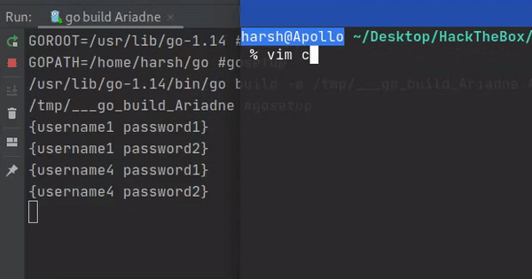

# CredManager Module
## Structure
A normal credential is defined with just username,password 
```go
// For general purpose
type Cred struct {
	Username string
	Password string
}
```

A credential log has multiple fields that might be important at elasticsearch level
Log Definition can be found at [CredManager/CredentialStructures.go](../CredManager/CredentialStructures.go)

## CredTracker
Provides a dynamic credential channel depending on a tracking file


## Credential Manager
Provides a `CredList` structure (defined at [CredManager/CredentialManager.go](../CredManager/CredentialManager.go))
that provides channel for credentials to be tested for other modules