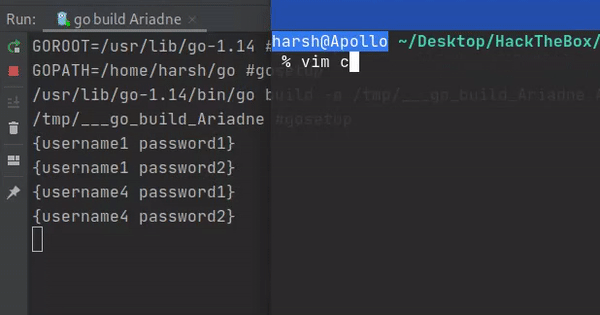

# CredManager Module
## Structure
A normal credential is defined with just username,password 
```go
// For general purpose
type Cred struct {
	Username string
	Password string
}
```

A credential log has multiple fields that might be important at elasticsearch level
Log Definition can be found at [CredManager/CredentialStructures.go](../../../CredManager/CredentialStructures.go)

## CredTracker
Provides a dynamic credential channel depending on a tracking file



### Working
1. When tracker finds new credentials in the tracked file, it parses it
2. Tracker removes duplicates from new credentials(compares to existing ones)
3. Tracker then goes through all different combinations of credentials possible with the new credentials
4. Tracker adds these new combinations to the channel for use by other modules

## Credential Manager
Provides a `CredList` structure (defined at [CredManager/CredentialManager.go](../../../CredManager/CredentialManager.go))
that provides channel for credentials to be tested for other modules
